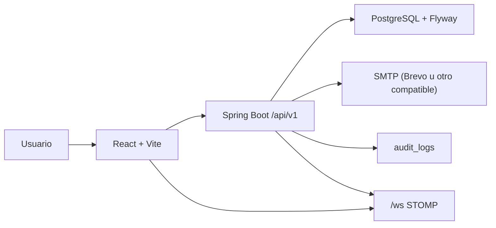

# Vision general de arquitectura

## Stack real

- frontend: React 19, TypeScript, Vite, React Router, Tailwind CSS, React Hook Form, Zod, TanStack Query, Zustand, STOMP
- backend: Spring Boot 3.4.5, Java 21, Spring Security, Spring Data JPA, Flyway, Spring Mail, WebSocket STOMP, OpenAPI, OpenPDF, Apache POI
- base de datos: PostgreSQL
- entorno local: Docker Compose

## Enfoque arquitectonico

- monorepo con `apps/web` y `apps/api`
- backend organizado por modulos de negocio dentro de un modular monolith
- API REST versionada en `/api/v1`
- autenticacion stateless con JWT de acceso y refresh token persistido
- multitenancy logico por `organizationId`
- auditoria a nivel de backend
- realtime sencillo para refrescar datos conectados

## Diagrama de alto nivel

## Flujo base

1. el usuario entra por frontend
2. el frontend autentica contra `/api/v1/auth/*`
3. el backend resuelve usuario, organizacion, rol y sede efectiva
4. la operacion persiste cambios en PostgreSQL
5. si aplica, el backend registra auditoria
6. si aplica, el backend publica un evento a `/topic/organizations/{organizationId}`
7. el frontend invalida queries y vuelve a consultar

## Limitaciones actuales

- no hay autenticacion especifica del canal WebSocket
- no existe centro de notificaciones en UI
- no existe pipeline de CI/CD real en el repo
- no hay capa dedicada de storage de archivos mas alla de `image_url`
