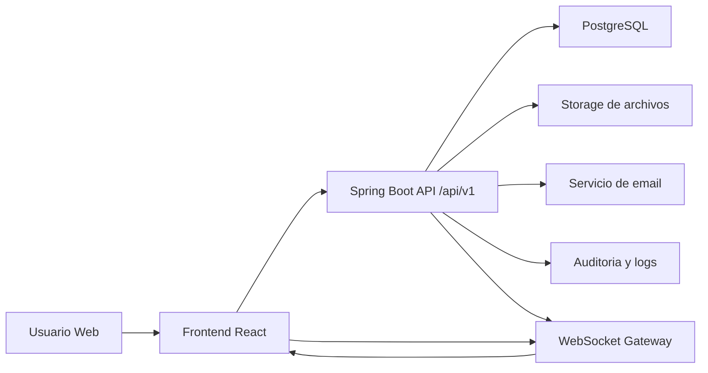

# Vision general de arquitectura

## Stack objetivo

- Frontend: React + TypeScript + Vite + React Router + Tailwind + shadcn/ui + TanStack Query + Zustand.
- Backend: Spring Boot + Java 21 + JPA/Hibernate + MapStruct + Lombok + OpenAPI.
- Base de datos: PostgreSQL + migraciones desde el inicio.
- Tiempo real: WebSockets.
- Infraestructura: monorepo con Docker, frontend en Vercel, backend en Render, datos en Supabase PostgreSQL a futuro.

## Enfoque arquitectonico

- monorepo;
- modular monolith por dominios;
- API REST versionada en `/api/v1`;
- auditoria obligatoria;
- separacion clara entre reglas de negocio, transporte y persistencia;
- soporte multi-organizacion desde el diseño inicial.

## Diagrama de alto nivel

## Flujo operacional base

1. el usuario autentica;
2. el frontend consume REST y escucha eventos en tiempo real;
3. el backend valida rol, organizacion y reglas de dominio;
4. se persiste el cambio en PostgreSQL;
5. se registra auditoria;
6. se emite evento a clientes conectados si aplica.

## Ejemplo

Un traslado de stock debe actualizar el saldo por ubicacion, crear movimientos relacionados, registrar auditoria y reflejar el nuevo balance en pantalla sin recargar.
