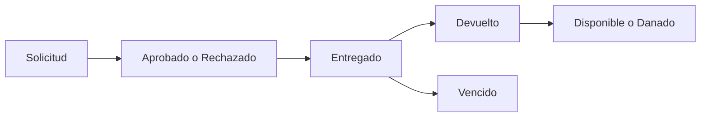

# Flujos principales del negocio

## Flujo 1 - Onboarding inicial

1. el propietario crea cuenta;
2. crea organizacion;
3. configura ubicacion principal;
4. revisa unidades y categorias semilla;
5. invita usuarios;
6. registra stock inicial.

## Flujo 2 - Registro de movimiento

1. seleccionar item;
2. seleccionar tipo de movimiento;
3. validar ubicacion y cantidad;
4. registrar motivo y responsable;
5. persistir movimiento;
6. actualizar stock y auditoria;
7. notificar en tiempo real si aplica.

## Flujo 3 - Ciclo de prestamo

## Flujo 4 - Consulta operativa

1. buscar articulo;
2. ver stock total y por ubicacion;
3. revisar historial;
4. revisar prestamos activos;
5. tomar accion.

## Ejemplo de friccion que debe evitarse

El usuario no debe tener que navegar tres pantallas distintas para registrar una salida simple de stock.
