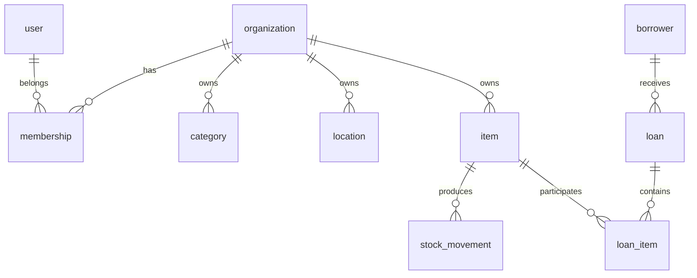

# Vision general del modelo de datos

## Objetivo

Soportar inventario multi-organizacion, movimientos auditables y prestamos con trazabilidad completa.

## Principios

- aislar datos por organizacion;
- evitar borrado fisico en entidades historicas;
- permitir consumibles y activos prestables;
- mantener historial de cambios criticos;
- preparar la base para crecer a nube sin rehacer el modelo.

## Bloques del modelo

- identidad y acceso;
- catalogos;
- inventario;
- movimientos;
- prestamos;
- auditoria;
- notificaciones.

## Diagrama conceptual

